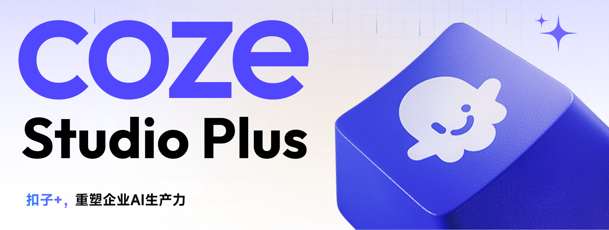
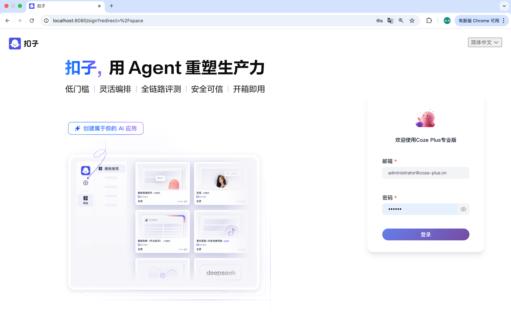
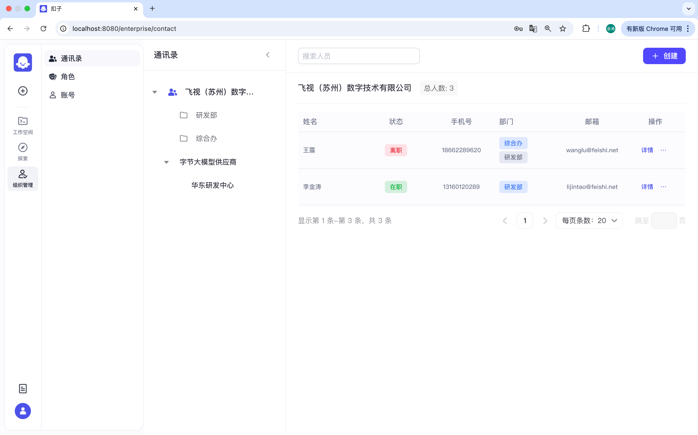
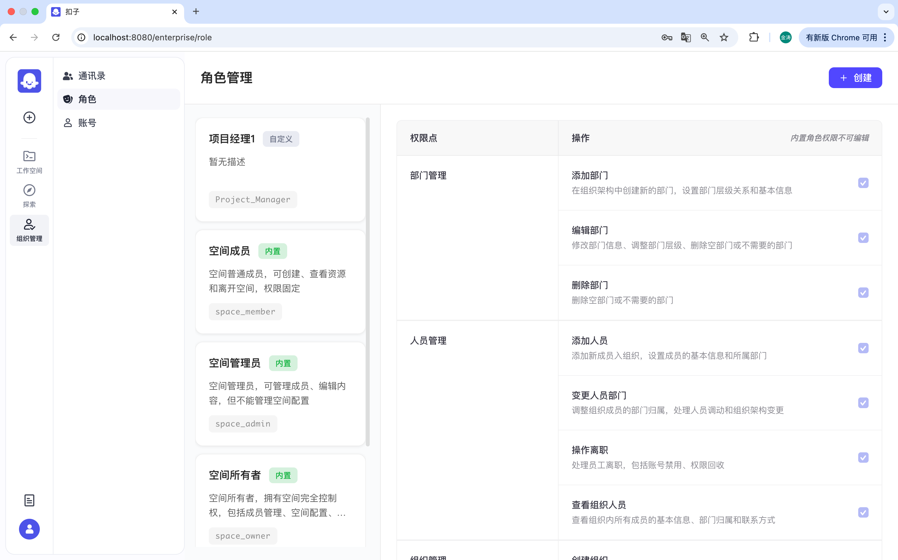
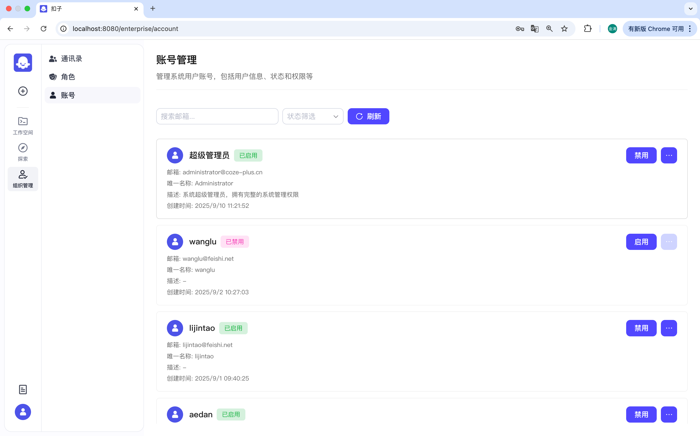

<div align="center">
<p>
  <a href="#什么是-coze-plus">Coze Plus</a> •
  <a href="#功能清单">功能清单</a> •
  <a href="#快速开始">快速开始</a> •
  <a href="#开发指南">开发指南</a>
</p>
<p>
  
  
</p>

</div>

## 什么是 Coze Plus

**Coze Plus** 是一款AI大模型知识库系统，帮助客户快速构建智能化的企业级供应商管理知识库、研发知识库、制造基地知识库、品质学习交流知识库、IT知识库、市场营销知识库系统，借助大模型的力量为你提供 AI 创作、AI 问答、AI 搜索等能力。

基于 [Coze Studio](https://www.coze.cn/home) 开源版本深度定制，Coze Plus 专注于企业知识管理场景，提供：

* **智能化知识管理**：构建各业务领域的专业知识库，实现知识的结构化存储和智能检索
* **AI 驱动的交互体验**：通过 AI 问答、AI 搜索、AI 创作等功能，让知识获取更加高效便捷
* **企业级权限管理**：完善的 RBAC 权限体系，支持组织架构、部门管理、角色权限等企业级功能
* **开箱即用的解决方案**：针对不同业务场景提供预置的知识库模板和智能体配置

Coze Plus 采用现代化技术架构，后端基于 Golang + Hertz 框架，前端使用 React + TypeScript，整体遵循微服务架构和领域驱动设计（DDD）原则，为企业提供稳定、高效、可扩展的知识管理平台。

## 功能清单

| **功能模块** | **功能点** |
| --- | --- |
| **企业管理** | * 组织架构管理 <br> * 部门层级管理 <br> * 人员管理与权限分配 |
| **权限体系** | * RBAC 角色权限管理 <br> * 细粒度权限控制 <br> * 用户角色分配与解绑 |
| **知识库管理** | * 多领域知识库构建 <br> * 智能文档解析与索引 <br> * 知识内容版本管理 |
| **AI 功能** | * AI 问答：基于知识库的智能问答 <br> * AI 搜索：语义化知识检索 <br> * AI 创作：内容生成与优化 |
| **模型服务** | 支持接入 OpenAI、火山方舟、通义千问等主流大模型服务 |
| **API 与集成** | * RESTful API 接口 <br> * 企业系统集成支持 <br> * Chat SDK 开发包 |

## 系统界面

<div align="center">
  <table>
    <tr>
      <td></td>
      <td></td>
    </tr>
    <tr>
      <td></td>
      <td></td>
    </tr>
  </table>
</div>

## 快速开始

了解如何获取并部署 Coze Plus，快速构建企业级知识管理系统。

环境要求：
* 在安装 Coze Plus 之前，请确保您的机器满足以下最低系统要求： 2 Core、4 GB
* 提前安装 Docker、Docker Compose，并启动 Docker 服务

部署步骤：

1. 获取源码
   ```bash
   # 克隆代码
   git clone https://github.com/coze-plus-dev/coze-plus.git
   cd coze-plus
   ```

2. 配置模型
   ```bash
   # 复制模型配置模板
   cp backend/conf/model/template/model_template_ark_doubao-seed-1.6.yaml backend/conf/model/ark_doubao-seed-1.6.yaml
   ```

   编辑配置文件 `backend/conf/model/ark_doubao-seed-1.6.yaml`，设置：
   * **id**：模型 ID（非零整数，全局唯一）
   * **meta.conn_config.api_key**：模型服务的 API Key
   * **meta.conn_config.model**：模型名称或 Endpoint ID

3. 部署并启动服务
   ```bash
   cd docker
   cp .env.example .env
   # 执行数据库迁移，初始化超级管理员账号
   docker compose up -d
   ```

4. 访问系统
   * 打开浏览器访问 `http://localhost:8888/`
   * 使用超级管理员账号登录：
     - 邮箱：`administrator@coze-plus.cn`
     - 密码：`coze-plus123456`

## 开发指南

* **企业级权限设计**：
  * [Casbin权限](docs/permission-guide.md)：了解 RBAC 权限体系

## 使用场景

### 企业知识管理场景

* **供应商管理知识库**：供应商信息、合作协议、质量标准等知识管理
* **研发知识库**：技术文档、研发规范、项目经验等知识沉淀
* **制造基地知识库**：生产工艺、设备维护、安全规范等制造知识
* **品质学习交流知识库**：质量控制、检测标准、经验分享等品质知识
* **IT 知识库**：技术文档、运维手册、故障解决方案等 IT 知识
* **市场营销知识库**：产品资料、营销策略、客户案例等营销知识

### AI 能力应用

* **智能问答**：基于企业知识库的专业问答服务
* **智能搜索**：语义化搜索，快速定位相关知识内容
* **内容生成**：AI 辅助创建文档、报告、总结等内容

## License

本项目采用 Apache 2.0 许可证。详情请参阅 [LICENSE](LICENSE) 文件。

## 社区贡献

我们欢迎社区贡献，期待您的参与！

## 支持开发者

如果这个项目对您有帮助，欢迎打赏支持开发者继续维护和改进项目：

<div align="center">
  
  <p><em>扫码微信打赏支持开发者</em></p>
</div>

## 加入社区

我们致力于构建一个开放、友好的开发者社区，欢迎所有对 AI Agent 开发感兴趣的开发者加入我们！

### 🐛 问题反馈与功能建议
为了更高效地跟踪和解决问题，保证信息透明和便于协同，我们推荐通过以下方式参与：
- **GitHub Issues**：[提交 Bug 报告或功能请求](https://github.com/coze-plus-dev/coze-plus/issues)
- **Pull Requests**：[贡献代码或文档改进](https://github.com/coze-plus-dev/coze-plus/pulls)

### 💬 技术交流与讨论
加入我们的技术交流群，与其他开发者分享经验、获取项目最新动态：

**微信群聊**
使用微信扫描下方二维码加入：


## 致谢
感谢所有为 Coze Studio 项目做出贡献的开发者和社区成员。特别感谢：

* [Eino](https://github.com/cloudwego/eino) 框架团队 - 为 Coze Studio 的智能体和工作流运行时、模型抽象封装、知识库索引构建和检索提供了强大的支持
* [FlowGram](https://github.com/bytedance/flowgram.ai) 团队 - 为 Coze Studio 的工作流画布编辑页提供了高质量的流程搭建引擎
* [coze-studio](https://github.com/coze-dev/coze-studio) - 为本项目提供一站式 AI Agent 开发工具
* [Hertz](https://github.com/cloudwego/hertz) 团队 - 高性能、强扩展性的 Go HTTP 框架，用于构建微服务
* 所有参与测试和反馈的用户
